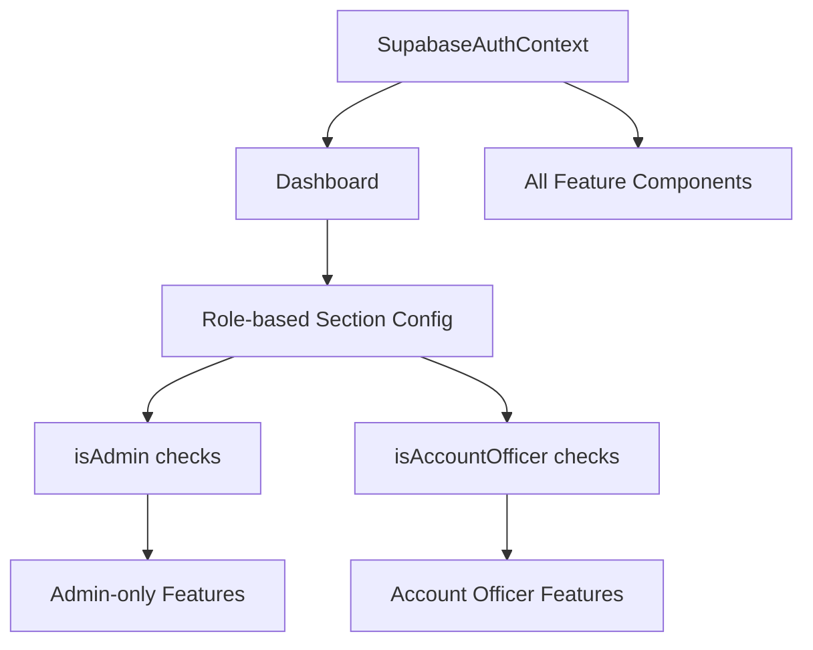

# Component Dependency Analysis & Feature Visibility Matrix

## Executive Summary

This document provides a comprehensive analysis of component dependencies and creates a detailed feature visibility matrix for implementing role-based access control in the Unique Expense Tracker application.

## 1. Component Architecture Overview

### 1.1 Application Structure
```
SupabaseApp.jsx (Root)
├── Context Providers (4 layers)
│   ├── ThemeProvider
│   ├── DemoProvider
│   ├── AuthProvider (Critical - provides user roles)
│   └── TimeRangeProvider
└── Content Components
    ├── DemoDashboard (Demo mode)
    ├── Dashboard (Main authenticated app)
    └── SupabaseLogin (Authentication)
```

### 1.2 Main Dashboard Components
```
Dashboard.jsx (Central Hub)
├── Lazy-loaded Feature Components
│   ├── ExpenseViewer (ExpenseList wrapper)
│   ├── ExpenseForm
│   ├── CategoryManager
│   ├── UserManager (Admin only)
│   ├── EnhancedAnalytics
│   ├── CSVImportExport
│   └── LoginActivityTracker (Admin only)
└── Navigation & UI Components
    ├── OptimizedLogo
    ├── ThemeToggle
    ├── GridNavigation
    └── Breadcrumb
```

## 2. Critical Component Dependencies

### 2.1 Authentication & Authorization Flow


**Key Dependencies:**
- **SupabaseAuthContext**: Provides `isAdmin`, `isAccountOfficer`, `userProfile`
- **Dashboard**: Uses role flags to configure `sectionConfig`
- **All Components**: Import `useAuth()` for role checking

### 2.2 Data Flow Dependencies
```
TimeRangeContext → EnhancedAnalytics → ExpenseViewer
                ↗                   ↘
    Dashboard                        Category Filters
```

**Critical Relationships:**
1. **TimeRangeContext** → **EnhancedAnalytics**: Date range filtering
2. **EnhancedAnalytics** → **ExpenseViewer**: Category selection pass-through
3. **CategoryManager** → **ExpenseForm**: Categories for dropdown
4. **SupabaseAuthContext** → **All Components**: API calls and permissions

### 2.3 State Management Flow
```
User Authentication → Role Detection → Component Visibility → Feature Access
```

## 3. Current Role-Based Access Implementation

### 3.1 Dashboard Section Configuration
```javascript
// From Dashboard.jsx - lines 64-145
const sectionConfig = useMemo(() => {
  return [
    { 
      id: 'expenses', 
      label: 'View Expenses', 
      show: userInfo.isAccountOfficer, // Only for account officers
      adminOnly: false
    },
    { 
      id: 'analytics', 
      label: 'Analytics Dashboard', 
      show: isAdmin, // Admin only
      adminOnly: true
    },
    { 
      id: 'users', 
      label: 'User Management', 
      show: isAdmin, // Admin only
      adminOnly: true
    },
    // ... more sections
  ];
}, [loading, userProfile, isAdmin, isAccountOfficer, userInfo]);
```

### 3.2 Component-Level Access Control
```javascript
// EnhancedAnalytics.jsx - Different tabs for different roles
<TabsList className={`grid w-full ${isAdmin ? 'grid-cols-3' : 'grid-cols-2 sm:grid-cols-4'}`}>
  
// ExpenseViewer - Account Officer specific features
{!isAdmin && (
  <Card className="border-2 border-blue-200">
    <CardTitle>Account Officer Date Filters</CardTitle>
    // Special UI for account officers
  </Card>
)}
```

## 4. Feature Visibility Matrix

### 4.1 Core Features by Role

| Feature | Admin | Account Officer | Guest | Dependencies |
|---------|-------|-----------------|--------|-------------|
| **Dashboard Navigation** | ✅ All sections | ✅ Limited sections | ❌ | Dashboard.sectionConfig |
| **View Expenses** | ✅ All expenses | ✅ Own expenses | ❌ | ExpenseViewer, TimeRangeContext |
| **Add Expense** | ✅ | ✅ | ❌ | ExpenseForm, CategoryManager |
| **Analytics Overview** | ✅ Full access | ✅ Full access | ❌ | EnhancedAnalytics |
| **Category Management** | ✅ Create/Edit/Delete | ✅ View only | ❌ | CategoryManager |
| **User Management** | ✅ Full control | ❌ | ❌ | UserManager |
| **Import/Export** | ✅ | ✅ | ❌ | CSVImportExport |
| **Login Activity** | ✅ | ❌ | ❌ | LoginActivityTracker |

### 4.2 Analytics Features by Role

| Analytics Feature | Admin | Account Officer | Dependencies |
|-------------------|-------|-----------------|-------------|
| **Overview Tab** | ✅ All data | ✅ Own data | EnhancedAnalytics, TimeRangeContext |
| **Expenses Tab** | ❌ (Admin uses overview) | ✅ With special date controls | ExpenseViewer with TimeRangeSlider |
| **Yearly Analysis** | ✅ | ✅ | YearSelector, MonthlyYearlyView |
| **Year Comparison** | ✅ | ✅ | YearComparisonView |
| **Category Analysis** | ✅ All categories | ✅ Limited to accessible categories | EnhancedAnalytics.categoryAnalysis |

### 4.3 ExpenseViewer Variations by Role

| ExpenseViewer Feature | Admin | Account Officer | Implementation |
|----------------------|-------|-----------------|----------------|
| **Date Range Controls** | ❌ (Uses Analytics filters) | ✅ Prominent blue-bordered section | Lines 972-1104 |
| **User Filter** | ✅ Can filter by user | ❌ | Lines 1151-1168 |
| **All Expenses View** | ✅ System-wide | ✅ Personal only (server-filtered) | Backend filtering |
| **Export Function** | ✅ All data | ✅ Personal data only | handleExport function |
| **Bulk Operations** | ✅ | ✅ | Multi-select functionality |

## 5. Component Interdependency Validation Rules

### 5.1 Must-Maintain Dependencies
```javascript
// Critical: These relationships must be preserved
1. SupabaseAuthContext → All components (for user context)
2. Dashboard → ExpenseViewer (category selection pass-through)
3. TimeRangeContext → Analytics components (date filtering)
4. CategoryManager → ExpenseForm (category options)
5. EnhancedAnalytics → ExpenseViewer (admin role integration)
```

### 5.2 Conditional Dependencies
```javascript
// These depend on user role
IF isAdmin THEN {
  UserManager: accessible
  LoginActivityTracker: accessible
  All user data: accessible
}

IF isAccountOfficer THEN {
  ExpenseViewer: personal data only
  Special date controls: enabled
  Category management: read-only
}
```

### 5.3 Feature Cascade Rules
```
IF Analytics disabled → TimeRangeContext still needed (ExpenseViewer uses it)
IF CategoryManager disabled → ExpenseForm must use fallback categories
IF ExpenseViewer disabled → Analytics charts should hide expense-specific features
```

## 6. Settings Component Architecture Design

### 6.1 Proposed Settings Structure
```javascript
// Settings component should be structured as:
Settings/
├── RoleBasedAccess/
│   ├── AdminSettings.jsx      // Full system configuration
│   ├── AccountOfficerSettings.jsx  // Personal preferences
│   └── FeatureToggleMatrix.jsx     // Role-based feature toggles
├── SystemSettings/
│   ├── CategoryDefaults.jsx
│   ├── DateRangeDefaults.jsx
│   └── ExportSettings.jsx
└── UserPreferences/
    ├── ThemeSettings.jsx
    ├── NotificationSettings.jsx
    └── DisplaySettings.jsx
```

### 6.2 Feature Toggle Configuration
```javascript
const featureMatrix = {
  admin: {
    canAccessUserManagement: true,
    canAccessLoginActivity: true,
    canViewAllExpenses: true,
    canEditAnyCategory: true,
    canDeleteCategories: true,
    canExportAllData: true
  },
  account_officer: {
    canAccessUserManagement: false,
    canAccessLoginActivity: false,
    canViewAllExpenses: false,
    canEditAnyCategory: false,
    canDeleteCategories: false,
    canExportAllData: false,
    // Officer-specific features
    requiresDateFilters: true,
    hasSpecialDateControls: true,
    canManageOwnExpenses: true
  }
};
```

## 7. Implementation Priority Order

### 7.1 Phase 1: Foundation (High Priority)
1. **Settings Component Shell** - Create basic settings structure
2. **Role Configuration Service** - Centralize role-based configurations  
3. **Feature Toggle System** - Implement feature visibility controls
4. **Validation Framework** - Ensure component dependencies are maintained

### 7.2 Phase 2: Enhanced Controls (Medium Priority)
1. **Advanced Permission Matrix** - Granular permission controls
2. **Dynamic Role Assignment** - Allow role changes with real-time updates
3. **Feature Dependency Mapper** - Automated dependency checking
4. **Settings Persistence** - Save user-specific settings

### 7.3 Phase 3: Administration (Lower Priority)
1. **Super Admin Controls** - System-wide configuration
2. **Feature Usage Analytics** - Track feature adoption
3. **Role-based Onboarding** - Different user flows by role
4. **Advanced Export Controls** - Role-based export restrictions

## 8. Migration Strategy

### 8.1 From Current to Role-Based System

**Step 1: Extract Current Logic**
```javascript
// Current: Hardcoded in Dashboard.jsx
show: isAdmin
show: isAccountOfficer

// Target: Centralized configuration
show: checkFeatureAccess('analytics', userRole)
show: checkFeatureAccess('userManagement', userRole)
```

**Step 2: Create Settings Component**
- Add new `/components/Settings/` directory
- Implement role-based feature toggles
- Integrate with existing Dashboard logic

**Step 3: Gradual Migration**
- Replace hardcoded role checks with configuration calls
- Test each component individually
- Maintain backward compatibility during transition

### 8.2 Validation Strategy
```javascript
// Before any change, validate:
1. User can still access their permitted features
2. Role transitions work correctly  
3. Component dependencies remain intact
4. No security regressions introduced
```

## 9. Security Considerations

### 9.1 Client-Side vs Server-Side
- **Client-side role checks**: UI hiding only (already implemented)
- **Server-side enforcement**: API endpoints respect user roles (already implemented)
- **Settings component**: Should not bypass server-side security

### 9.2 Role Transition Safety
- When roles change, ensure UI updates immediately
- Clear cached data that might be role-specific
- Validate new permissions before allowing access

## 10. Conclusion

The current implementation already has a solid foundation for role-based access control. The main areas for enhancement are:

1. **Centralization**: Move role logic to a dedicated settings system
2. **Consistency**: Standardize how role checks are performed
3. **Flexibility**: Allow dynamic feature toggling
4. **Maintainability**: Simplify adding new roles or features

The component dependencies are well-structured and should be preserved during any settings implementation. The most critical relationship is the SupabaseAuthContext providing role information to all components, which serves as the foundation for the entire access control system.