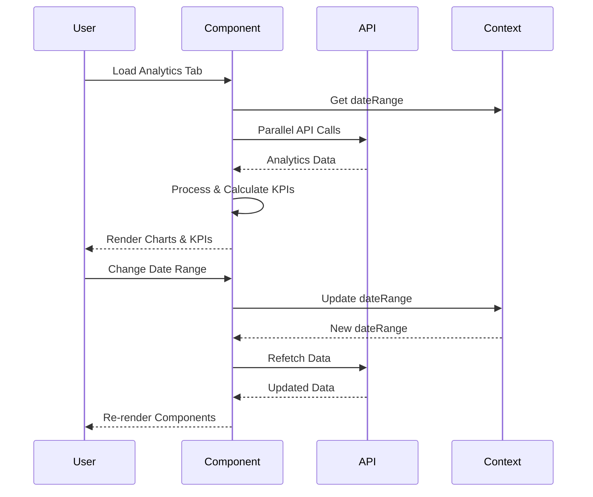

# Enhanced Analytics - Component Architecture

## 🏗️ Architecture Overview

The Enhanced Analytics component follows a modular, tab-based architecture with separation of concerns for data management, visualization, and user interaction.

## 📁 File Structure

```
EnhancedAnalytics/
├── EnhancedAnalytics.jsx           # Main component (970 lines)
├── Dependencies/
│   ├── TimeRangeSlider.jsx         # Shared time range control
│   ├── YearSelector.jsx            # Year selection component  
│   ├── MonthlyYearlyView.jsx       # Monthly/yearly analytics
│   ├── YearComparisonView.jsx      # Multi-year comparison
│   ├── InsightsDashboard.jsx       # AI insights component
│   └── ExpenseViewer.jsx           # Detailed expense list
└── Context/
    ├── TimeRangeContext.jsx        # Shared date range state
    └── SupabaseAuthContext.jsx     # Authentication state
```

## 🧩 Component Hierarchy

```jsx
EnhancedAnalytics
├── Tabs (shadcn/ui)
│   ├── TabsList
│   │   ├── TabsTrigger("overview")
│   │   ├── TabsTrigger("expenses") // Account officers only
│   │   ├── TabsTrigger("yearly")
│   │   ├── TabsTrigger("comparison")
│   │   └── TabsTrigger("insights")
│   │
│   ├── TabsContent("overview")
│   │   ├── TimeRangeSlider
│   │   ├── AnalyticsFilters
│   │   │   ├── LegacyPresets (Select)
│   │   │   ├── StartDate (Input)
│   │   │   ├── EndDate (Input)
│   │   │   └── RefreshButton
│   │   ├── CategoryAnalysis
│   │   │   ├── CategorySelector (Select)
│   │   │   ├── CategoryKPIs (3 Cards)
│   │   │   └── MonthlyTrendChart (BarChart)
│   │   ├── MainKPIs (4 Cards)
│   │   │   ├── TotalSpent
│   │   │   ├── TotalExpenses  
│   │   │   ├── TopCategory
│   │   │   └── CategoriesUsed
│   │   ├── MainChart
│   │   │   ├── ChartToggle (Stacked/Donut)
│   │   │   ├── StackedBarChart (Recharts)
│   │   │   └── DonutChart + Legend
│   │   └── ExpenseViewer // Admin only
│   │
│   ├── TabsContent("expenses") // Account officers only
│   │   ├── TimeRangeSlider
│   │   └── ExpenseViewer
│   │
│   ├── TabsContent("yearly")
│   │   ├── YearSelector
│   │   └── MonthlyYearlyView
│   │
│   ├── TabsContent("comparison")
│   │   └── YearComparisonView
│   │
│   └── TabsContent("insights")
│       └── InsightsDashboard
```

## 🔄 Data Flow Architecture

### State Management Pattern

```javascript
// Component-level state
const [loading, setLoading] = useState(true);
const [error, setError] = useState('');
const [activeTab, setActiveTab] = useState('overview');

// Analytics data state
const [categoryBreakdown, setCategoryBreakdown] = useState([]);
const [monthlyCategoryData, setMonthlyCategoryData] = useState([]);
const [kpiData, setKpiData] = useState({...});

// Configuration state
const [selectedCategory, setSelectedCategory] = useState('all');
const [monthlyChartType, setMonthlyChartType] = useState('stacked');

// Context consumption
const { dateRange, handlePresetChange } = useTimeRange();
const { apiCall, isAdmin } = useAuth();
```

### Data Flow Sequence



## 📊 API Integration Architecture

### Parallel Data Fetching Strategy

```javascript
const fetchAnalyticsData = useCallback(async () => {
  const requests = [];
  
  // 1. Spending trends endpoint
  requests.push(
    apiCall(`/analytics/spending-trends?...`)
      .catch(err => ({ error: err.message, type: 'trends' }))
  );
  
  // 2. Category breakdown endpoint  
  requests.push(
    apiCall(`/analytics/category-breakdown?...`)
      .catch(err => ({ error: err.message, type: 'categories' }))
  );
  
  // 3. Monthly-category breakdown endpoint
  requests.push(
    apiCall(`/analytics/monthly-category-breakdown?...`)
      .catch(err => ({ error: err.message, type: 'monthly-category' }))
  );

  // Execute all requests in parallel
  const [trends, categories, monthlyCategory] = await Promise.all(requests);
  
  // Process responses with error handling
}, [apiCall, dateRange, selectedCategory]);
```

### Fallback System Architecture

```javascript
// Primary API Strategy
┌─────────────────────────────────────┐
│ Analytics API Endpoints             │
│ ├── /analytics/spending-trends      │
│ ├── /analytics/category-breakdown   │
│ └── /analytics/monthly-category-... │
└─────────────────────────────────────┘
                 │
                 ▼
          [API Response Check]
                 │
      ┌──────────┴──────────┐
      ▼                     ▼
   SUCCESS                FAILED
      │                     │
      ▼                     ▼
[Use API Data]    [Fallback Strategy]
                           │
                           ▼
                  ┌─────────────────┐
                  │ Direct Expenses │
                  │ API Call        │
                  │ /expenses?...   │
                  └─────────────────┘
                           │
                           ▼
                  [Client-side Processing]
                  ├── Group by category
                  ├── Calculate totals
                  └── Generate breakdown
```

## 🎨 UI Component Architecture

### Responsive Design System

```css
/* Mobile First Approach */
.kpi-grid {
  grid-template-columns: 1fr;                    /* Mobile: Stack */
  
  @media (min-width: 768px) {
    grid-template-columns: repeat(2, 1fr);       /* Tablet: 2 columns */
  }
  
  @media (min-width: 1024px) {
    grid-template-columns: repeat(4, 1fr);       /* Desktop: 4 columns */
  }
}
```

### Chart Component Architecture

```jsx
// Chart Toggle Pattern
const ChartContainer = () => (
  <Card>
    <CardHeader>
      <div className="flex justify-between">
        <CardTitle>Chart Title</CardTitle>
        <ChartTypeToggle />
      </div>
    </CardHeader>
    <CardContent>
      {chartType === 'stacked' ? (
        <StackedBarChart />
      ) : (
        <DonutChartWithLegend />
      )}
    </CardContent>
  </Card>
);
```

### Chart Rendering Architecture

```jsx
// Recharts Integration Pattern
<ResponsiveContainer width="100%" height={400}>
  <BarChart data={data} margin={{ top: 20, right: 30, left: 20, bottom: 5 }}>
    <CartesianGrid strokeDasharray="3 3" />
    <XAxis dataKey="month" />
    <YAxis tickFormatter={formatCurrency} />
    <Tooltip content={CustomTooltip} />
    <Legend />
    {categories.map((category) => (
      <Bar 
        key={category}
        dataKey={category}
        stackId="spending"
        fill={categoryColors[category]}
      />
    ))}
  </BarChart>
</ResponsiveContainer>
```

## 🧠 Context Integration

### TimeRangeContext Usage

```javascript
// Context Provider Pattern
<TimeRangeProvider>
  <EnhancedAnalytics />
</TimeRangeProvider>

// Context Consumer Pattern  
const {
  dateRange,           // { startDate: string, endDate: string }
  selectedPreset,      // Current preset selection
  handlePresetChange,  // Update preset and dates
  handleDateRangeChange // Update specific date
} = useTimeRange();
```

### Authentication Context Integration

```javascript
const {
  apiCall,       // Authenticated API wrapper
  isAdmin,       // Role-based boolean
  userProfile    // User details
} = useAuth();

// Role-based rendering
{isAdmin && <AdminOnlyComponent />}
{!isAdmin && <AccountOfficerComponent />}
```

## 🔧 Configuration Architecture

### Feature Flag System

```javascript
// Role-based tab configuration
const sectionConfig = useMemo(() => [
  {
    id: 'overview',
    show: true,              // Always visible
    adminOnly: false
  },
  {
    id: 'expenses', 
    show: !isAdmin,          // Account officers only
    adminOnly: false
  },
  {
    id: 'yearly',
    show: true,              // Always visible
    adminOnly: false
  }
], [isAdmin]);
```

### Chart Configuration System

```javascript
// Chart type configuration
const chartConfig = {
  monthlyChart: {
    types: ['stacked', 'donut'],
    default: 'stacked',
    toggle: true
  },
  categoryChart: {
    types: ['donut'],
    default: 'donut', 
    toggle: false
  }
};
```

## 🚀 Performance Architecture

### Optimization Strategies

1. **Lazy Loading**: Component-level code splitting
2. **Memoization**: `useCallback` for expensive functions
3. **Parallel Requests**: Simultaneous API calls
4. **Conditional Rendering**: Only render when data exists
5. **Responsive Charts**: Auto-sizing containers

### Memory Management

```javascript
// Cleanup pattern
useEffect(() => {
  return () => {
    // Cleanup subscriptions, timers, etc.
  };
}, []);

// Memoized calculations
const kpiCalculations = useMemo(() => ({
  totalSpent: categoryBreakdown.reduce((sum, cat) => sum + cat.value, 0),
  averageExpense: totalExpenses > 0 ? totalSpent / totalExpenses : 0
}), [categoryBreakdown]);
```

## 🧪 Testing Architecture

### Component Testing Strategy

```javascript
// Test file structure
EnhancedAnalytics.test.jsx
├── Rendering Tests
│   ├── Should render all tabs
│   ├── Should show loading state
│   └── Should handle empty data
├── Interaction Tests
│   ├── Tab switching
│   ├── Date range changes
│   └── Chart type toggles
├── API Integration Tests
│   ├── Successful data fetch
│   ├── Error handling
│   └── Fallback system
└── Role-based Tests
    ├── Admin features
    └── Account officer features
```

### Mock Data Architecture

```javascript
// Mock data structure
const mockAnalyticsData = {
  categoryBreakdown: [
    { name: 'Office Supplies', value: 1500, count: 12, color: '#3B82F6' }
  ],
  monthlyCategoryData: [
    { month: 'Jan 2024', 'Office Supplies': 500, total: 500 }
  ],
  kpiData: {
    totalSpent: 1500,
    totalExpenses: 12,
    averageExpense: 125
  }
};
```

## 🔒 Security Architecture

### Data Validation

```javascript
// API response validation
const validateAnalyticsData = (data) => {
  if (!data || typeof data !== 'object') return false;
  if (!Array.isArray(data.breakdown)) return false;
  return data.breakdown.every(item => 
    typeof item.name === 'string' &&
    typeof item.value === 'number' &&
    item.value >= 0
  );
};
```

### Role-based Access Control

```javascript
// Access control patterns
const AdminOnlySection = ({ children }) => {
  const { isAdmin } = useAuth();
  return isAdmin ? children : null;
};

const ConditionalTab = ({ show, children }) => {
  return show ? children : null;
};
```

---

**Architecture Version**: 1.0.0  
**Component Size**: 970 lines  
**Dependencies**: 8 external components  
**API Endpoints**: 4 primary + fallback  
**Last Updated**: 2025-08-24